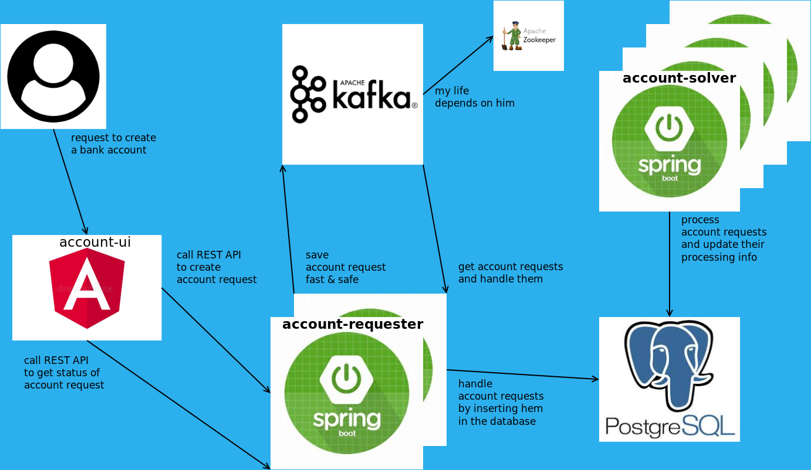

# bank-account-app
Demo application exercise for creating a bank account for existing clients.
A user which is the bank's client, should be able to access a page to open a new savings bank account. The opening of the account can happen only Monday-Friday and between hours 9-18.

We assume that the user is already logged, so we are not interested in the authentication.

We concentrate our exercise only on the opening of the account. We make a clear distinction between acknowledging the request of the client and the actual opening of the account. Because we, internally, have the restriction that we cannot open an account anytime but only in specific days and hours, this doesn't mean that we respond to the client that we cannot honour his request for exampple on a Sunday at 13:00. We will take his request any time 24/7, and we inform him that his request to create an account was acknowledged and he will be informed when the account is created. Meanwhile we will create the account in the background according to the internal restrictions.

We can achieve this separation of requesting an account and the actual creation of the account by implementing 2 separated backend microservices called account-requester and account-solver. The account-requester will take the user's request and send it as a message on a Kafka topic, which will be processed to insert an account request record in a Postgresql database. And here the job of the account-requester is done. Then, the account-solver will pick an account request and will start to solve the request by doing whatever necessary to create a bank account, which in our case is just the creation of a record in the accounts table in the database because this is just an example. Also, this separation of the account request creation and solving into 2 different microservices will allow us to scale them granularly.

This activity is summarized in the following diagram. All the components of this architecture are deployed as docker containers so the diagram will show the interaction betweeken these docker containers.


The docker containers are implemented as follows:  

Kafka, Zookeeper, Postgres containers run docker images found on https://hub.docker.com. Check the docker-compose file /docker/deploy/ing.yml to see exactly what image versions I used.

Account Requester and Account Solver containers run the docker images built from the SpringBoot applications that I implemented: account-requester and account-solver.

Account UI container runs the image built from the Angular application that I implemented: account-ui.


# How to build & deploy the applications locally on your Ubuntu Linux computer

## Prerequisite tools: 
```
openjdk-14.0.1, node-v12.16.2-linux-x64, docker, docker-compose, psql, mvn, git
```

We are going to install all the tools and this project in the Linux home directory, so set the working directory to ~
```
cd ~
```

Install java
```
wget https://download.java.net/java/GA/jdk14.0.1/664493ef4a6946b186ff29eb326336a2/7/GPL/openjdk-14.0.1_linux-x64_bin.tar.gz
tar -xf openjdk-14.0.1_linux-x64_bin.tar.gz
```

Install node
```
wget https://nodejs.org/dist/v12.16.2/node-v12.16.2-linux-x64.tar.xz
tar -xf node-v12.16.2-linux-x64.tar.xz
```

Open ~/.profile file
```
nano ~/.profile
```

At the end of the file copy these lines and then save the file
```
export JAVA_HOME=~/openjdk-14.0.1
export PATH=~/node-v12.16.2-linux-x64/bin:~/openjdk-14.0.1/bin:$PATH
```

Because you updated the .profile file you normally should restart Ubuntu so that the env variables JAVA_HOME and PATH to be updated for every terminal that you open, but if you don't want to restart you have to remember that in every new terminal that you open first thing you want to do is to run this command `source ~/.profile`

Install docker-compose
```
sudo curl -L "https://github.com/docker/compose/releases/download/1.25.5/docker-compose-$(uname -s)-$(uname -m)" -o /usr/local/bin/docker-compose
sudo chmod +x /usr/local/bin/docker-compose
```

Let's install the rest of the tools using Ubuntu apt
```
sudo apt install docker
sudo apt install psql
sudo apt install mvn
sudo apt install git
```

At the end of all these instalations the tools's version should look like this:
```
java -version
openjdk version "14.0.1" 2020-04-14
OpenJDK Runtime Environment (build 14.0.1+7)
OpenJDK 64-Bit Server VM (build 14.0.1+7, mixed mode, sharing)

npm version
{
  npm: '6.14.4',
  ares: '1.15.0',
  brotli: '1.0.7',
  cldr: '36.0',
  http_parser: '2.9.3',
  icu: '65.1',
  llhttp: '2.0.4',
  modules: '72',
  napi: '5',
  nghttp2: '1.40.0',
  node: '12.16.2',
  openssl: '1.1.1e',
  tz: '2019c',
  unicode: '12.1',
  uv: '1.34.2',
  v8: '7.8.279.23-node.34',
  zlib: '1.2.11'
}

sudo docker version
Client:
 Version:           18.09.7
 API version:       1.39
 Go version:        go1.10.4
 Git commit:        2d0083d
 Built:             Fri Aug 16 14:19:38 2019
 OS/Arch:           linux/amd64
 Experimental:      false

Server:
 Engine:
  Version:          18.09.7
  API version:      1.39 (minimum version 1.12)
  Go version:       go1.10.4
  Git commit:       2d0083d
  Built:            Thu Aug 15 15:12:41 2019
  OS/Arch:          linux/amd64
  Experimental:     false


sudo docker-compose version
docker-compose version 1.25.5, build 8a1c60f6
docker-py version: 4.1.0
CPython version: 3.7.5
OpenSSL version: OpenSSL 1.1.0l  10 Sep 2019

psql --version
psql (PostgreSQL) 9.5.21

mvn --version
Apache Maven 3.3.9
Maven home: /usr/share/maven
Java version: 14.0.1, vendor: Oracle Corporation
Java home: /home/mimi/.jdks/openjdk-14.0.1
Default locale: en_US, platform encoding: UTF-8
OS name: "linux", version: "4.4.0-166-generic", arch: "amd64", family: "unix"

git --version
git version 2.7.4
```

## Download, Build & Deploy the bank-account-app project

Download project
```
cd ~
git clone https://github.com/ChelaruViorel/bank-account-app.git
```

Build npm modules for account-ui Angular app. These modules occupy a lot of space and they can be installed locally anytime so there is no point to put them in git because they will increase a lot the download time.
```
cd ~/bank-account-app/account-ui
npm install
```

Build the project. You'll call the build all script that will build the code and the docker images for the account-requester, account-solver and account-ui projects.
```
cd ~/bank-account-app/docker/build
./build-all.sh
```

How to deploy the docker containers locally.
```
cd ~/bank-account-app/docker/deploy
./deploy.sh
```

After deploying, you can run `sudo docker ps` to see if they are running. The output of docker ps command should look like this:
```
CONTAINER ID        IMAGE                      COMMAND                  CREATED             STATUS                  PORTS                                  NAMES
77ed7a2b167a        account-requester:latest   "java --enable-previ…"   1 second ago        Up Less than a second   0.0.0.0:9001->9001/tcp                 account-requester
8791565ef196        account-solver:latest      "java --enable-previ…"   1 second ago        Up Less than a second   9001/tcp, 0.0.0.0:9002->9002/tcp       account-solver
d88eb33550d8        wurstmeister/kafka         "start-kafka.sh"         2 seconds ago       Up 1 second             9092/tcp, 0.0.0.0:9093->9093/tcp       kafka
f7c6aa845a2e        postgres:latest            "docker-entrypoint.s…"   3 seconds ago       Up 1 second             0.0.0.0:5432->5432/tcp                 db
2d8c3de0148e        wurstmeister/zookeeper     "/bin/sh -c '/usr/sb…"   3 seconds ago       Up 2 seconds            22/tcp, 2181/tcp, 2888/tcp, 3888/tcp   zookeeper
ff8fde3c6aea        account-ui:latest          "nginx -g 'daemon of…"   3 seconds ago       Up 2 seconds            8080/tcp, 0.0.0.0:4200->80/tcp         account-ui
```

How to undeploy the docker containers.
```
cd ~/bank-account-app/docker/deploy
./undeploy.sh
```

# How to access and use the application
Now that we deployed the application locally, we can try to access it.

## Web
Access the application in the browser at this url `http://localhost:4200` The web page requires a client CNP and an initial deposit number to submit the form.

For existing client CNPs you can find 2 clients in the database by querying `select * from clients` . 

The web form's fields have Angular validators, so both fields must not be empty, and initial deposit must be a number. Otherwise the submit button will be disabled.

## Database
Access the database using psql
```
psql -h localhost -U ing 
```

The password is `ing`, database name is `ing`, and here are the tables
```
select * from clients;
select * from account_request;
select * from account;
select * from account_worker_heartbeat;
```

## Docker
To access the container logs
```
sudo docker logs -f account-requester
sudo docker logs -f account-solver
```

To get a terminal inside the docker container (I use jdk-alpine images that have only sh not bash)
```
sudo docker exec -ti account-requester sh
sudo docker exec -ti account-solver sh
```

## Other usefull commands
```
sudo docker-compose -f ing.yml up -d
sudo docker-compose -f ing.yml down
sudo docker container prune

#from host
psql -h localhost -U ing

#from container
sudo docker exec -it  db bash
> psql -U ing


sudo docker exec -ti kafka bash
kafka-topics.sh --zookeeper zookeeper:2181 --list
kafka-topics.sh --create --zookeeper zookeeper:2181 --replication-factor 1 --partitions 1 --topic accounts
kafka-console-producer.sh --broker-list localhost:9092 --topic accounts
kafka-console-consumer.sh --bootstrap-server localhost:9092 --topic accounts --group console-group

#count messages in topic
sudo docker exec -ti kafka bash
kafka-run-class.sh kafka.tools.GetOffsetShell --broker-list localhost:9092 --topic accounts
```
