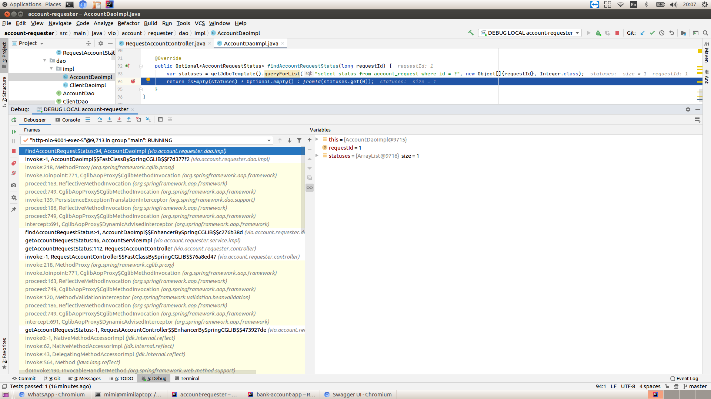
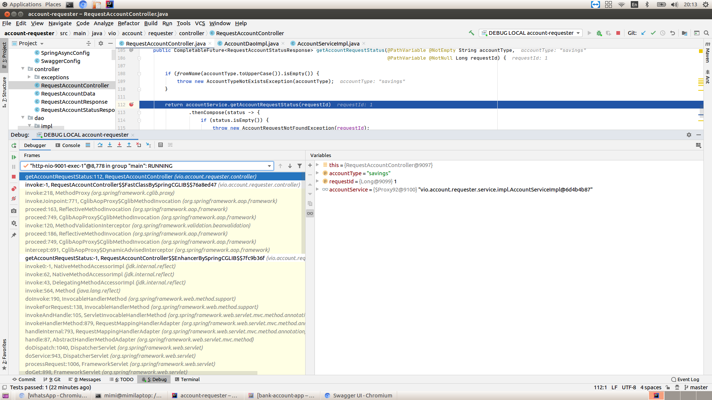
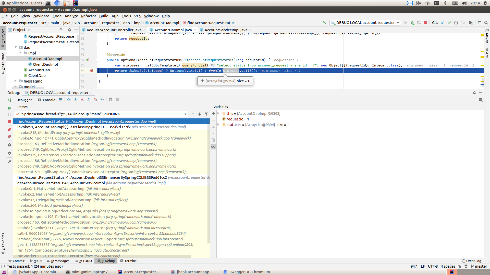
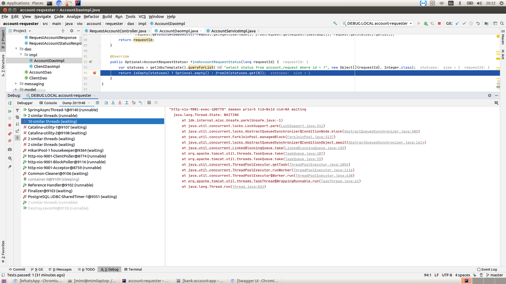

# account-requester Spring Boot application
The account-requester SpringBoot app takes fast and safe the request to create a bank account from the user without actually processing the request. The entrypoint in the API is the RequestAccountController.

## What is the benefit of implementing the RequestAccountController asynchronously with @Async and CompletableFuture ?

The controller RequestAccountController is implemented asynchronously. What does this mean ? It means that every async method in the controller will return a CompletableFuture and not the exact object.

Let's take as example the method getAccountRequestStatus() in RequestAccountController, which normally, not implemented asynchronously, would look like this:
```
@GetMapping("/{accountType}/request/{requestId}/status")
RequestAccountStatusResponse getAccountRequestStatus(
                                      @PathVariable String accountType, 
                                      @PathVariable Long requestId) 
```
and implemented asynchronously, returns a CompletableFuture
```
@GetMapping("/{accountType}/request/{requestId}/status")
CompletableFuture<RequestAccountStatusResponse> getAccountRequestStatus ( 
                                      @PathVariable String accountType, 
                                      @PathVariable Long requestId) 
```

When the user sends a request to the RequestAccountController, this request is executed in one of the threads of the Tomcat thread pool.
This thread pool has 200 threads by default, but this setting can be changed in the application.yaml by declaring the property server.tomcat.max-threads.

The getAccountRequestStatus() method calls the AccountService that calls the AccountDao which queries the database for the status of the account request id specified.

If the method is implemented synchronously, all these operations will be executed in the Tomcat's thread.

But if we implement the method asynchronously (which will see exactly how in a few moments), we could offload all these operations from the Tomcat's thread and move them on a separate thread pool, this way letting Tomcat's thread serve other user requests, while the current user is waiting for his CompletableFuture to complete.

### Async implementation 
By default, CompletableFuture tasks are executed in the ForkJoinPool.commonPool(). As the name suggests, this is a common pool for all CompletableFuture-s in the Spring Boot application, so to detach the execution of the CompletableFuture-s of the controllers from other CompletableFuture-s in our application, let's define a dedicated thread pool.
```
@Slf4j
@EnableAsync //enable async so that @Async annotations have an effect
@Configuration
public class SpringAsyncConfig {

    @Bean
    public Executor springAsyncTasksExecutor() {
        int cores = Runtime.getRuntime().availableProcessors();

        final ThreadPoolTaskExecutor executor = new ThreadPoolTaskExecutor();
        
        executor.setCorePoolSize(cores / 2); //start small, and grow as needed
        executor.setMaxPoolSize(cores); 
        
        executor.setQueueCapacity(100);
        executor.setThreadNamePrefix("SpringAsyncThread-");
        executor.initialize();

        log.info("Started Spring async task executor with max " + cores + " threads.");
        return executor;
    }
}
```
As you see the threads we customized the thread name prefix to see these threads better at debugging time.

Next step, is to declare @Async the AccountService function that we call in the RequestAccountController.
```
@Slf4j
@Service
public class AccountServiceImpl implements AccountService {

    @Autowired
    private AccountDao accountDao;

    @Async //we could specify the thread pool name to use, but our Executor defined in SpringAsyncConfig is application wide.
    @Override
    public CompletableFuture<Optional<AccountRequestStatus>> getAccountRequestStatus(long requestId) {
        return CompletableFuture.completedFuture(accountDao.findAccountRequestStatus(requestId));
    }
}
```

And now the method getAccountRequestStatus() in RequestAccountController.
```
    @GetMapping("/{accountType}/request/{requestId}/status")
    public CompletableFuture<RequestAccountStatusResponse> getAccountRequestStatus(@PathVariable String accountType,
                                                                                   @PathVariable Long requestId) {

        if (fromName(accountType.toUpperCase()).isEmpty()) {
            throw new AccountTypeNotExistsException(accountType);
        }

        return accountService.getAccountRequestStatus(requestId)
                .thenCompose(status -> {
                    if (status.isEmpty()) {
                        throw new AccountRequestNotFoundException(requestId);
                    }
                    return completedFuture(new RequestAccountStatusResponse(status.get().name()));
                });
    }
```

Cool, so now, when a GET /{accountType}/request/{requestId}/status is made, a thread from the Tomcat's thread pool is allocated for processing our request, but all it does is to chain multiple CompletableFuture-s and return the last one, and then going back into the Tomcat's thread pool to be used for other requests. Meanwhile we wait for the chain of CompletableFuture-s to finish execution in the custom SpringAsyncThread-* thread pool.

## The proof that the async implementation works
We can prove the async implementation works by debugging and observing the stack trace.
Let's see first, that in the synchronous implementation, the operations are all executed by a thread in Tomcat's thread pool.
Just for this proof, I will comment @Async in AccountsService, which will make the implementation synchronous even if we are using CompletableFuture.
```
@Slf4j
@Service
public class AccountServiceImpl implements AccountService {

    @Autowired
    private AccountDao accountDao;

    //@Async !!!!!!!!
    @Override
    public CompletableFuture<Optional<AccountRequestStatus>> getAccountRequestStatus(long requestId) {
        return CompletableFuture.completedFuture(accountDao.findAccountRequestStatus(requestId));
    }
}
```
If we debug with a breakpoint in the AccountDaoImpl.findAccountRequestStatus() we get see in the following stack trace that AccountDaoImpl.findAccountRequestStatus() is executed in Tomcat's thread http-nio-9001-exec-5:



Let's get back to the async implementation by uncommenting back the @Async in AccountServiceImpl
```
@Slf4j
@Service
public class AccountServiceImpl implements AccountService {

    @Autowired
    private AccountDao accountDao;

    @Async
    @Override
    public CompletableFuture<Optional<AccountRequestStatus>> getAccountRequestStatus(long requestId) {
        return CompletableFuture.completedFuture(accountDao.findAccountRequestStatus(requestId));
    }
}
```
We will debug again but now with 2 breakpoints: 1 breakpoint in RequestAccountController.getAccountRequestStatus() and 1 breakpoint in AccountDaoImpl.findAccountRequestStatus().
And we start the debugger again. And our first stop is in the RequestAccountController.getAccountRequestStatus() where we can see that the request is still served by a thread in the Tomcat's thread pool, named http-nio-9001-exec-1.


And we resume the debugger's execution which takes us to the next stop, in AccountDaoImpl.findAccountRequestStatus(), where we can see that function AccountDaoImpl.findAccountRequestStatus() runs in our custom thread pool, specifically in the thread named SpringAsyncThread-1.


And also, we can see that the Tomcat thread that initially served our request has already finished his job, and it's parked because there are no other requests to serve.


So this concludes our proof that the asynchronous implementation is working correctly.
